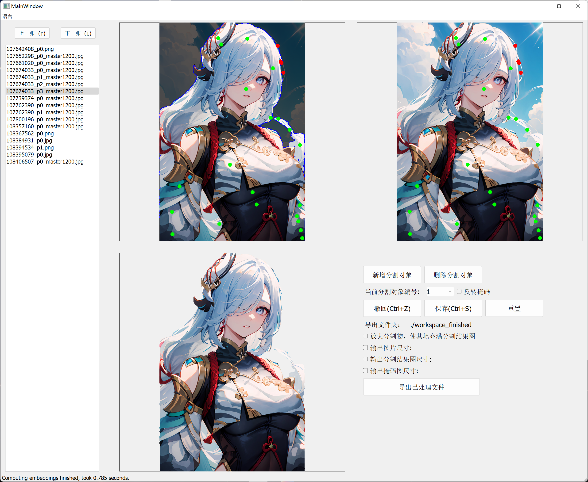

# Segment-Anything-Qt-Gui
Qt gui application for Facebook's Segment Anything Model(SAM).



# Todo
- [x] Release Code
- [ ] English Translation

# Launch
使用如下命令安装：
```
git clone https://github.com/nhjydywd/segment-anything-qt-gui

cd segment-anything-qt-gui

pip install requirements.txt
```

程序处理的图片来自workspace/images文件夹，请预先建立workspace/images文件夹，并将要分割的图片存放到该文件夹中，然后使用如下命令启动程序：
```
python .\src\mainwindow.py
```
所有图片处理完成后，需要点击右下角的“导出已处理文件”。等待数秒，即可导出对应的分割结果和掩码。

# Shortcut Keys
| 快捷键      | 功能描述 |
| ----------- | ----------- |
| 方向键 ↓ 或鼠标滚轮向下      | 切换到下一张图片      |
| 方向键 ↑ 或鼠标滚轮向上   | 切换到上一张图片        |
| Ctrl + S   | 保存        |
| Ctrl + Z   | 撤回        |


# Features
- 后台计算：切换图片时自动在后台计算Embedding，几乎可以做到用户无感。
- 点与框提示：使用左键绘制正面提示点(绿色)，右键绘制负面提示点(红色)；使用Ctrl+左键绘制提示框。
- 实时预览：鼠标悬浮在图片上，可查看预览效果。
- 多目标分割：如需分割多个对象，可在右下角功能区点击“新增分割对象”。


# Notes
- 程序默认采用sam-vit-h模型，需要10G显存。如需使用其它模型，可修改background.py中的model_type变量。
- 程序分辨率针对1440x900和3840x2560显示器进行适配，如果在您的分辨率上表现不佳，可以在mainwindow.py的resizeUI函数中进行修改。